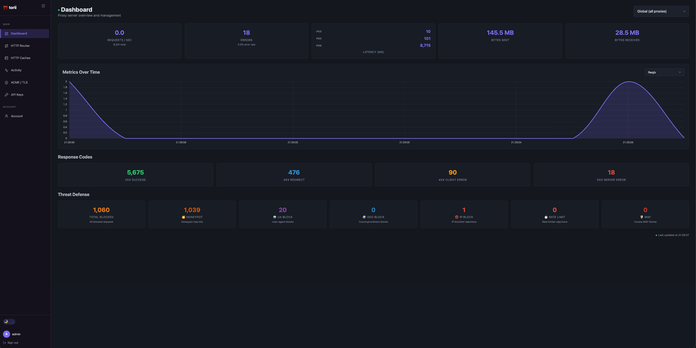
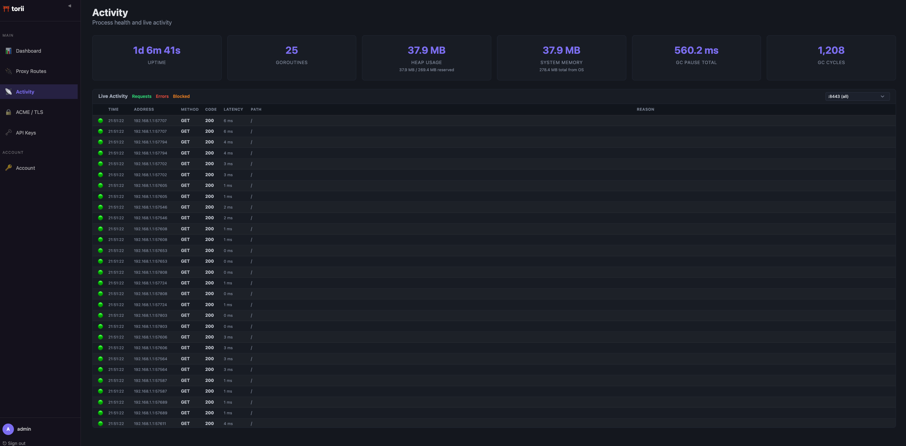
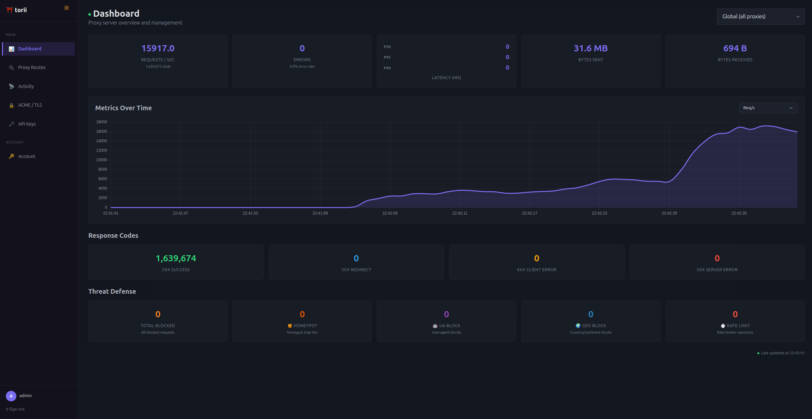
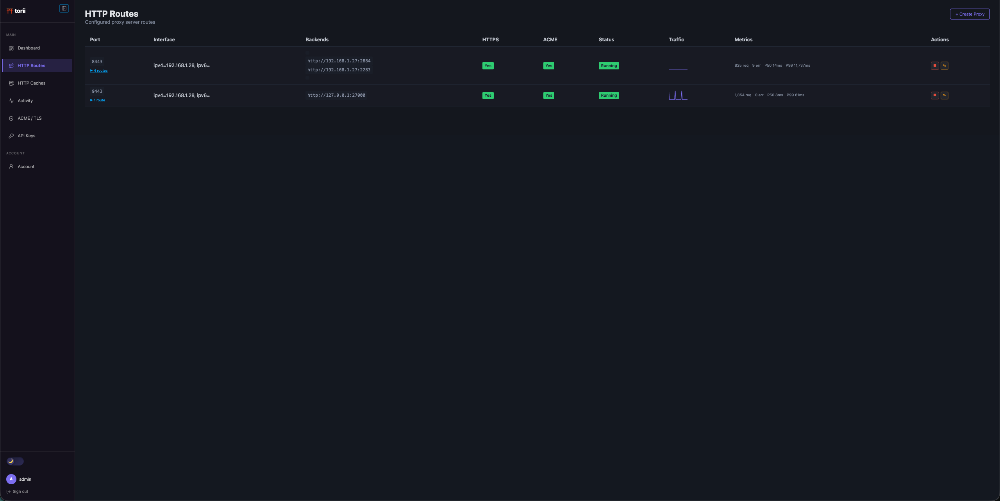

<p align="center">
<pre>
  _              _ _
 | |_ ___  _ __ (_|_)
 | __/ _ \| '_ \| | |
 | || (_) | |   | | |
  \__\___/|_|   |_|_|
</pre>
</p>

<p align="center">
  <b>See everything hitting your server. Block what shouldn't be there.</b>
</p>

---

<p align="center">
  
</p>

<p align="center">
  <i>Live dashboard on a Raspberry Pi exposed to the internet. Every request, every blocked IP, every bot caught — in real time.</i>
</p>

---

## What is this?

A reverse proxy with a built-in security dashboard. One binary, one config file, no dependencies.

You point it at your services, expose it to the internet, and watch what happens. Torii handles routing, TLS certificates, rate limiting, and bot defense — and shows you all of it live.

## 30-second start

```bash
go build -o torii ./cmd/torii
./torii -config config.yaml --debug
```

Open `http://127.0.0.1:27000/ui`, set your password, and you're looking at live traffic. `--debug` starts stub backends so you can explore without configuring real services.

### Minimal config

```yaml
log:
  log-level: INFO

api-server:
  host: 127.0.0.1
  port: 27000

net-config:
  http:
    - port: 80
      default:
        backend: http://192.168.1.50:8080
```

That's it. Torii adds request logging, metrics, and request IDs automatically.

Full configuration reference → [docs/configuration.md](docs/configuration.md)

---

## What it catches

Torii is running on a Raspberry Pi 3 with ports open to the internet. Here's what a typical day looks like:

- **Scanners probing for vulnerabilities** — `.env`, `wp-login.php`, `.git/config` — caught by honeypot traps and auto-blocked
- **Known scanner user agents** — Nuclei, zgrab, scrapers, AI crawlers — matched and blocked on sight
- **IPs with known abuse history** — checked against AbuseIPDB in real time
- **Brute-force attempts** — rate limited with proper `429` + `Retry-After`, repeat offenders blocked
- **Traffic from unexpected countries** — geo-blocked before it reaches your services

Everything that gets blocked shows up in the dashboard with timestamps, IPs, and the reason it was caught.

|                    Activity Log                    |                    Under Load                    |
|:--------------------------------------------------:|:------------------------------------------------:|
|          |      |

---

## What it does

**Routing** — HTTP/HTTPS, virtual-host routing, path-based routing with wildcards, per-path backend overrides.

**Automatic TLS** — Let's Encrypt via DNS-01. No port 80 required. Per-domain SNI. Background renewal.

**Bot defense** — UA blocking (scanners, scrapers, AI crawlers), honeypot traps with optional trickster mode (tarpits, fake credentials, infinite streams), GeoIP blocking.

**Rate limiting** — Token-bucket, global or per-client IP.

**Circuit breaker** — Stops forwarding to unhealthy backends until they recover.

**AbuseIPDB integration** — Check client IPs against community abuse reports. Optionally report blocked IPs back.

**Live dashboard** — Hierarchical metrics (global → route → path), real-time request and error logs via SSE, blocked IP log.

**14 composable middlewares** — all per-route or per-path. [Full list →](docs/configuration.md#middleware-reference)

---

## Homepage integration

Torii has scoped API keys for read-only stats access. Add this to your [Homepage](https://gethomepage.dev) config:

```yaml
- Torii:
    icon: shield
    href: http://127.0.0.1:27000/ui
    widget:
      type: customapi
      url: http://127.0.0.1:27000/api/v1/proxy/metrics
      headers:
        Authorization: Bearer <your-api-key>
      mappings:
        - field: total_requests
          label: Requests
        - field: blocked_ips
          label: Blocked IPs
```

<p align="center">
  
</p>

---

## Screenshots

|                  Dashboard                   |                    Proxy Routes                    |
|:--------------------------------------------:|:--------------------------------------------------:|
|  |  |

---

## Installation

### Binary

```bash
go build -o torii ./cmd/torii
./torii -config config.yaml
```

### Docker

```bash
docker run -d \
  --network host \
  -v torii-data:/data \
  -v /path/to/config.yaml:/etc/torii/config.yaml \
  ghcr.io/nunoOliveiraqwe/torii:latest
```

`--network host` is recommended so Torii can bind directly to host interfaces.

| Mount | Purpose |
|---|---|
| `torii-data:/data` | SQLite database (persists across restarts) |
| `/path/to/config.yaml` | Config file |

<details>
<summary>Building from source (Docker)</summary>

```bash
docker build -f docker/Multistage.Dockerfile -t torii .
```

Torii uses `mattn/go-sqlite3` which requires CGO. The binary must be built with `CGO_ENABLED=1`.

</details>

### Debian / Ubuntu

```bash
dpkg -i torii_<version>_amd64.deb
```

---

## Performance

Full middleware chain over HTTPS on a **Raspberry Pi 3** (4-core ARM, 906 MB RAM):

| Concurrency | Req/s | p50 | p99 |
|:-----------:|------:|----:|----:|
| 10 | **663** | 12 ms | 98 ms |
| 100 | **656** | 146 ms | 359 ms |

**Desktop** (AMD 9800X3D, 32 GB RAM):

| Concurrency | Req/s | p50 | p99 |
|:-----------:|------:|----:|----:|
| 100 | **9,540** | 9 ms | 96 ms |
| 200 | **13,114** | 12 ms | 100 ms |

---

## Documentation

- [Configuration & Middleware Reference](docs/configuration.md)
- [Management API](docs/api.md)


## TODO

Keeping track of what's done and what's next. This is not a roadmap, just my personal scratchpad for the project.


### Needs work
- [x] IP block lists: middleware is registered, filtering logic is stubbed out
- [ ] Create HTTP Proxy UI: works, but the UX needs another pass
- [ ] ACME UI: need a delete button for individual certificates, the reset button placement is bad
- [ ] Proxy Routes UI: host names should be clickable links that open in a new tab
- [ ] Server timeouts: review the defaults for the Create HTTP Proxy wizard

### Up next
- [ ] Config persistence: proxy routes created or deleted via the UI are memory-only — they need to be written back to the config file so they survive restarts - not sure if I will. maybe with an overridable flag, because if I want to expose the proxy API to the internet for dynamic route management, I don't want those changes written to disk, and if I want to manage the config through the file, I don't want the UI overwriting it. Maybe a `persist-ui-changes` flag that defaults to `false` and can be set per-route or globally. Also maybe don't even allow proxy route changes to be created. If the session is hijacked, then not much can be done if no config can be done. Ask for password when creating a proxy!!!!!
- [x] Wildcard host matching: `VirtualHostDispatcher` uses exact map lookup, no support for `*.home.example.com`. Replace the `map[string]http.Handler` in `VirtualHostDispatcher` with a reversed-label trie so wildcard routes match with DNS-style semantics (one label only, most-specific wins). Priority chain: exact match → longest wildcard match → `default` → 502. Normalize to lowercase, strip trailing dots. Watch out for ACME domain collection (preserve `*.example.com` for wildcard cert issuance) and SNI matching in TLS config.
- [x] CPU usage in system activity: add CPU usage metrics to the system health/activity dashboard alongside the existing memory and other system stats.
- [x] Terminating middleware support in UI: update the Create/Edit Proxy UI so that when a terminating middleware (e.g., Redirect) is present in the chain, the backend field becomes optional. Currently the UI always requires a backend.
- [x] Route editing in UI: add edit support for existing proxy routes through the web UI (there is already a comment/placeholder for this in the codebase). Users should be able to modify host, backend, middlewares, and path rules for an existing route without deleting and recreating it.
- [ ] TCP proxying: config schema is there, implementation is not
- [x] Make `RequestId`, `RequestLog`, and `Metrics` default on all endpoints (too easy to forget and then the dashboard shows nothing)
- [x] Blocked IP observability: surface blocked IPs (from honeypot, UA blocker, country block) in the UI with timestamps and metadata, probably as a rolling log
- [x] API keys: Homepage integration endpoint, `read_config` and `write_config` scopes (may be dropped depending on how useful they turn out to be)
- [ ] UA fingerprint rotation detection: bots that rotate user agents mid-scan are easy to spot — a real client doesn't switch from macOS to Linux to Windows between requests. Track UA consistency per IP and flag or block IPs whose OS/browser family changes unnaturally fast. I encountered this with a bot that rotated through 20+ UAs in a single scan, hitting 100+ endpoints in minutes. The honeypot caught it, but this would be another layer of defense against UA rotation.
- [ ] Coraza WAF integration: [Coraza](https://coraza.io/) is a full-featured open-source WAF (OWASP CRS compatible). Add it as a middleware so routes can opt into proper WAF rules alongside the existing bot defense. There's overlap with what the honeypot and UA blocker already do, but Coraza covers a much wider surface (SQLi, XSS, protocol violations, etc.).
- [x] AbuseIPDB middleware: check client IPs against [AbuseIPDB](https://www.abuseipdb.com/) and block or flag IPs with a high abuse confidence score. Optionally report blocked IPs back (honeypot hits, rate-limit violations, etc.) so the community benefits too.


### Known Bugs
- [x] **ACME port leak on startup:** if a route has `use-acme: true` but ACME is not configured, the server fails to start. Starting the proxy manually afterwards returns an ACME error, but the port is already bound from the first attempt. A second manual start then fails with a "bind: address already in use" error. The listener from the failed first start is never closed.
- [ ] **ACME config not loadable from config file:** there is no way to specify ACME configuration (provider, credentials, etc.) in the YAML config file. On first start with `use-acme: true`, it should be possible to seed the ACME configuration from the config file instead of requiring it to be set up through the UI first.

### Maybe
- [ ] Proxy-level authentication: login pages so the proxy handles auth before forwarding to backends
- [ ] Dedicated tar pitting middleware (separate from the honeypot trickster mode)
- [ ] Login endpoint rate limiting

## Requirements

- Go 1.25+

## License

[GNU Affero General Public License v3.0](LICENSE)
